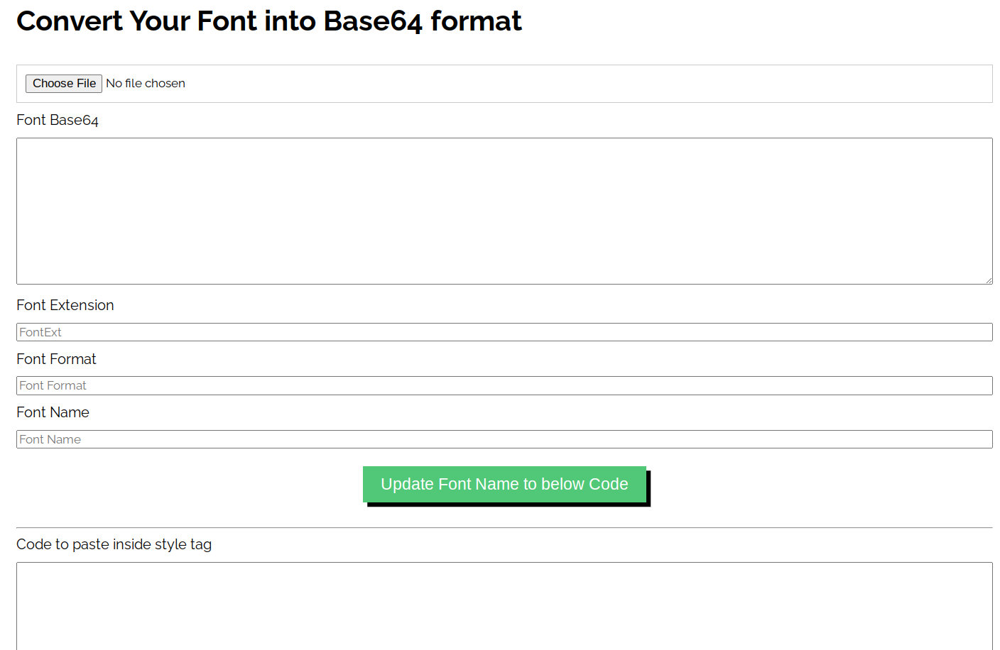

## What is Alofonts.com

Welcome to [AloFonts.com](https://alofonts.com), your one-stop destination for an extensive collection of over 30,000 fonts! At AloFonts.com, we bring you a diverse array of fonts to cater to all your creative and typographic needs. Whether you're a graphic designer, web developer, or simply someone looking to add a personal touch to your projects, our website offers a treasure trove of font options.

Website: [https://alofonts.com](https://alofonts.com)

With our user-friendly interface, you can easily explore and download fonts that suit your style and preferences. But that's not all – AloFonts.com takes your font exploration to the next level by allowing you to try out each font online. Experience the visual impact of different typefaces firsthand as you type and see the characters dynamically displayed in real-time on each font's dedicated webpage.

Our commitment to providing a seamless and interactive experience sets us apart. The fonts are loaded dynamically on each font webpage, enabling you to preview and assess how they look with your desired text before making a download decision. This feature ensures that you can make informed choices and find the perfect font for your projects.

Whether you're searching for a classic serif, a modern sans-serif, or a unique display font, [AloFonts.com](https://alofonts.com) has you covered. Explore the vast collection, experiment with different styles, and elevate your creative endeavors with the perfect typography.

Unlock a world of possibilities with AloFonts.com – where fonts meet functionality, and creativity knows no bounds!

## Random Font at Alofonts

Link: [Random Font](https://alofonts.com/random-font/)

Our exciting "Random Font" feature – a playful twist to your font discovery experience at AloFonts.com! Dive into a world of serendipity as you explore this unique page that randomly selects fonts from our extensive database of over 30,000 typefaces.

With the "Random Font" page, creativity takes the reins, offering you a spontaneous and fun way to discover fonts you might not have considered otherwise. Embrace the element of surprise as each click unveils a new font, sparking inspiration and adding an element of unpredictability to your creative process.

Whether you're seeking fresh ideas, a unique aesthetic, or just a touch of randomness in your font selection, the "Random Font" feature is your go-to destination. It's a delightful journey through the diverse world of typography, encouraging you to step outside your comfort zone and find the perfect font for your next project in the most unexpected way.

Give your creativity a boost and let the "Random Font" feature at AloFonts.com be your guide – because sometimes, the best discoveries happen by chance!

## Convert Your Font to Base64

Link: [https://alofonts.com/font-to-base64/](https://alofonts.com/font-to-base64/)

Unlock the power of seamless font integration with AloFonts.com's "Convert to Base64" utility. This versatile tool empowers users to effortlessly transform TTF, OTF, or WOFF font files into Base64 format, streamlining the process for web development and enhancing overall performance.

Gone are the days of manual encoding – our user-friendly interface allows you to simply upload your font files, and in a matter of seconds, obtain the Base64-encoded version. This conversion not only facilitates the incorporation of fonts into web projects but also optimizes performance by reducing the need for additional HTTP requests.

Web developers and designers will appreciate the efficiency of this tool, providing a hassle-free solution for encoding fonts. The straightforward process ensures that you can focus more on the creative aspects of your projects, without the complexities of manual encoding.

Experience the convenience of the "Convert to Base64" utility at AloFonts.com, where innovation meets efficiency. Elevate your web typography seamlessly, as this tool empowers you to effortlessly encode fonts and enhance your online projects with speed and precision. Say goodbye to encoding headaches and embrace the simplicity of font integration with our intuitive and practical Base64 conversion tool.

